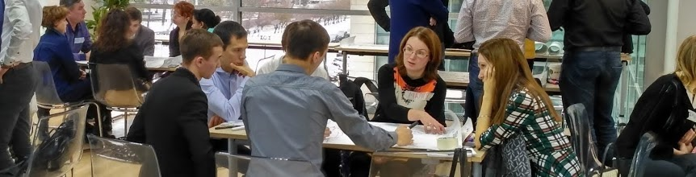

# Схематизация

Это сайт неформального исследовательского сообщества — "Схематизация". Наша группа была создана в 2014 году для изучения, использования и массового распространения одноименного процесса коллективного мышления в традиции СМД-подхода ["Московского методологического кружка"](https://ru.wikipedia.org/wiki/%D0%9C%D0%BE%D1%81%D0%BA%D0%BE%D0%B2%D1%81%D0%BA%D0%B8%D0%B9_%D0%BC%D0%B5%D1%82%D0%BE%D0%B4%D0%BE%D0%BB%D0%BE%D0%B3%D0%B8%D1%87%D0%B5%D1%81%D0%BA%D0%B8%D0%B9_%D0%BA%D1%80%D1%83%D0%B6%D0%BE%D0%BA) в рамках цикла игр «Технологии мышления» под руководством [П.Г.Щедровицкого](https://shchedrovitskiy.com/).

Организация коллективного мышления в нашей редакции имеет свою принципиальную ⚙️ технологию —

Схематизация - это коллективное рисование на листах 6 человек схем - чертежей рабочих ситуаций деятельности в 4-х (иногда в 5-ти) планах "Системы-2" - оргструктурном, процессном, материальном, (связи) и функциональном с перспективой их объединения на одном листе флипчарта с разделением слоев мышления, коммуникации и деятельности ... [продолжение ⏩](https://osovsky.medium.com/schem-b1810498982d)

На первом этапе мы предлагаем группам нарисовать, «объект управления» - город или предприятие. Рисование - это на самом деле работа по анализу ситуации. Выделение и рисование на доске главных элементов связей и процессов в группах происходит обычно по-разному. Незрелое понимание, как устроен объект управления, ограничивается графическими метафорами цветка, дерева, вселенной, карты понятий и тп., Зрелое понимание может быть выражено, например, как географическая карта с разделением на социально-экономические классы и слоем управления и рефлексии ... [продолжение ⏩](https://osovsky.medium.com/game-5438c730a15e)

C 2010 года мы регулярно проводим различные сессии* в крупных компаниях, таких, как SAP, Ernst & Young, BAT, PriceWaterhouseCoopers, Газпром-Информ и т.п. В некоммерческих организациях - таких, как Фонд развития электронной демократии (с участием министра связи России Игоря Щеголева), Ассоциации молодежных правительств на площадке Петербургского экономического форума и др. Фрагменты игр показывали 5-й канал, Сов.секретно, Евроньюс. Все такие мероприятия, а их за это время было более 150 ... [продолжение ⏩](https://osovsky.medium.com/1000-933152b709f1)

* Заполнить заявку на проведение игры можно [здесь](https://forms.gle/HoPUJCpU8v2jDTf86)🚀