# Архив игр ГРУППЫ

        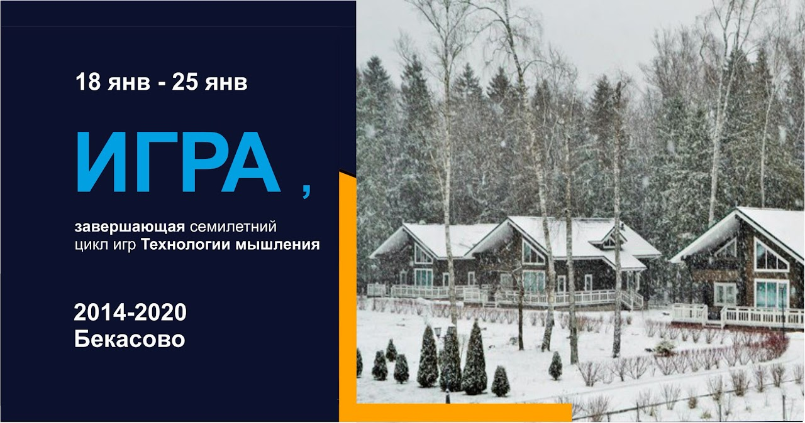

        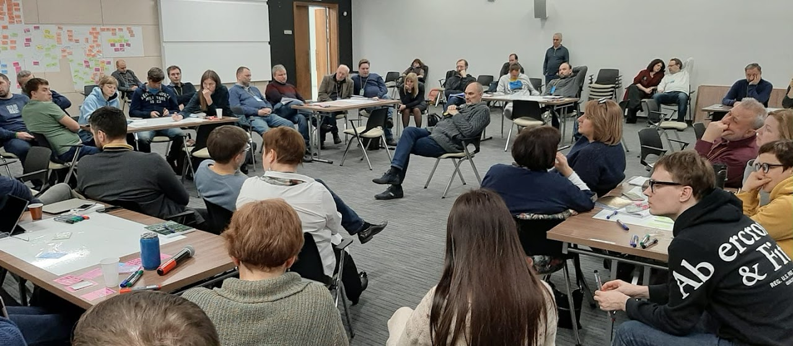

        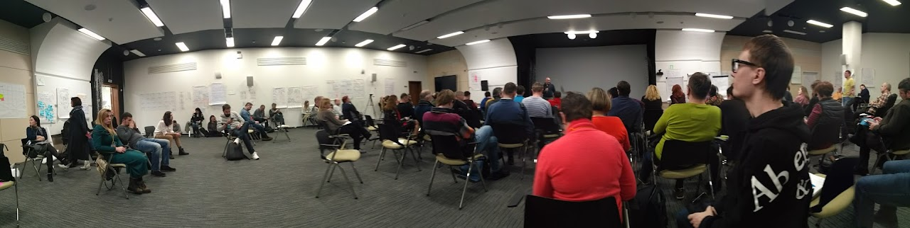

        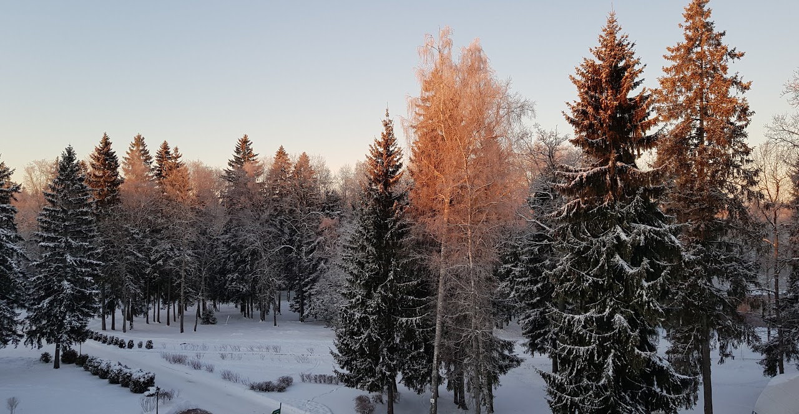

        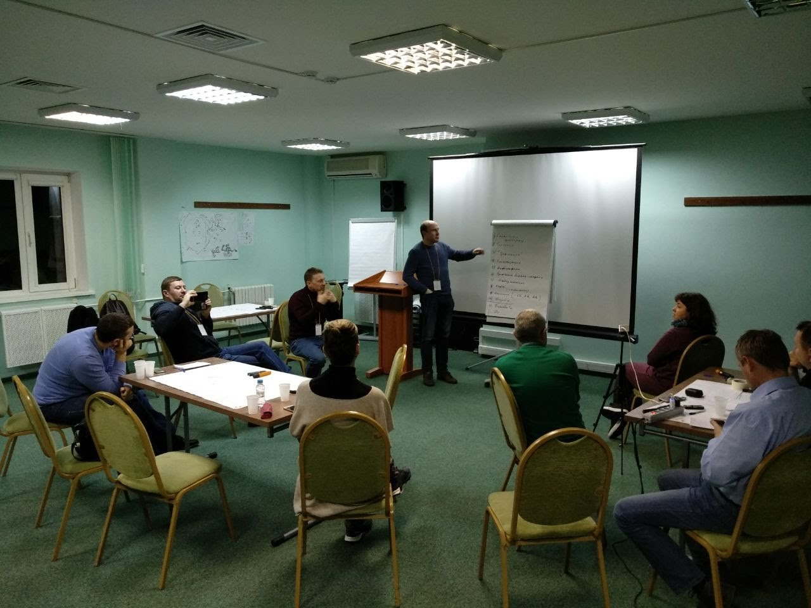

        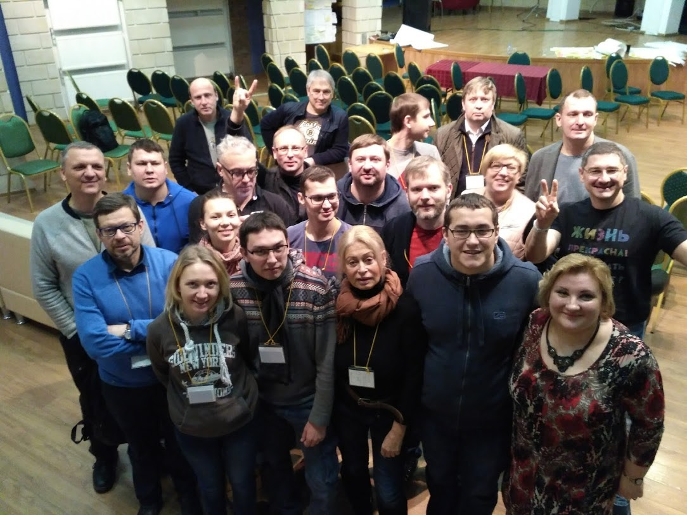

        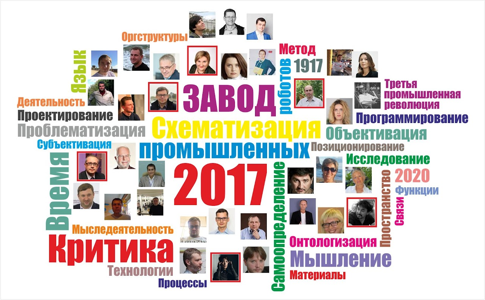

        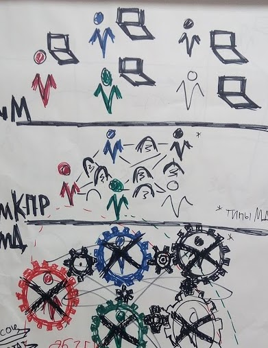

        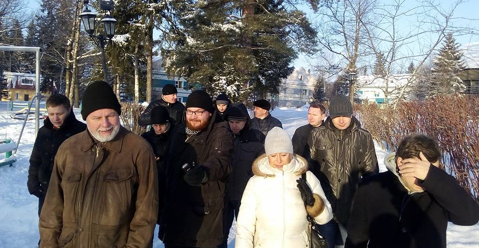

        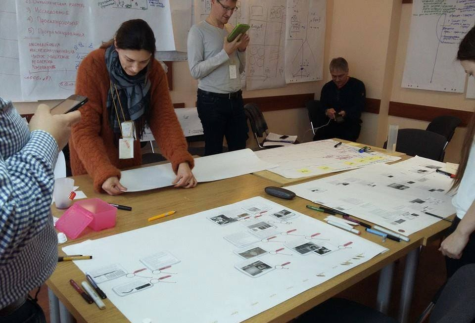

        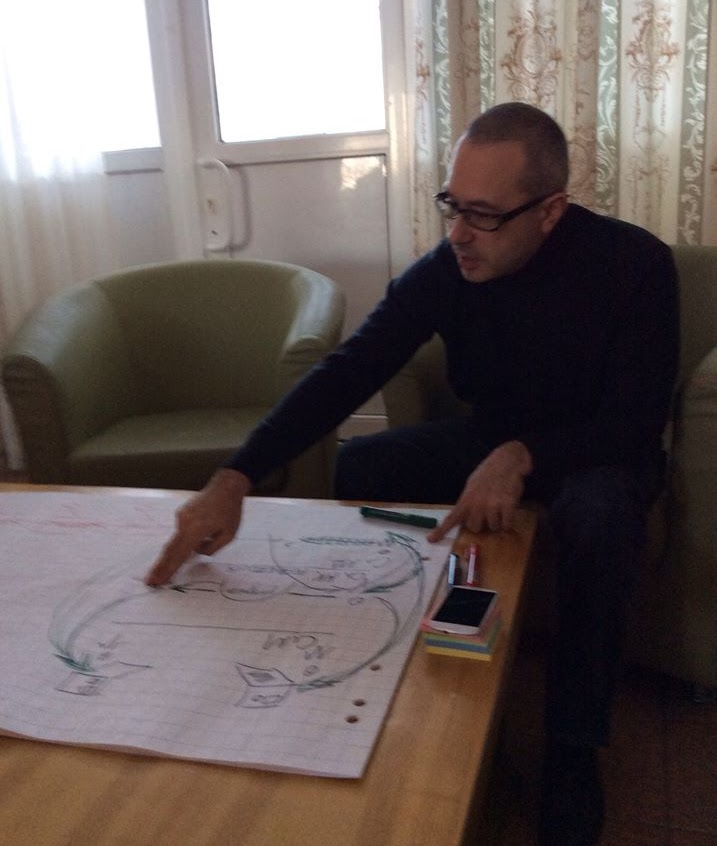

      ## Игра 2020 год

      Видео [1-й день](https://photos.app.goo.gl/7PGMXJinbYxDVsGN9), 2-й день, 3-й день, Фото

      ## Игра 2019 год

      Аудио (диктофонные записи), Видео, [Фото](https://photos.app.goo.gl/H46ctXB3s7jU7aeo8)

      ## Работа группы 2018 год

      Аудио (диктофонные записи), [Видео](https://photos.app.goo.gl/giaqFhnnSZFuFPar2), Фото

      22.01.2018 1 доклад от группы (А.Кушнер, О.Егорова) презентация, звук с 1:01:55 по 1:27:10, расшифровка,
        видео

      27.01.2018 Рефлексия от группы (Осовский) презентация,
        [звук](https://drive.google.com/open?id=1p9VlGAH4BMbtewyBeqOvFbGCXI6xgwg2), расшифровка,
        видео

      27.02.2018 Письмо
          участникам группы о планах на 2018-2019 гг

      1.11.2018 Отчет
          за 2018 год

      ## Работа группы 2017 год

      [Видео](https://photos.app.goo.gl/TwjvRB0nDkfBBzlW2), Фото

      Меморандум
          группы "Завод промышленных роботов" (Гайдамака, Злотников)

      Вопросы
          в группе

      ### Новые группы:

      Университет схематизации (Мрдуляш)

      Схематизатор (Голышенкова, Сокольников) звук с 57:00

      Общественно-политическое продюссирование (Корякин) звук

      Проектирование (Гайдамака) [звук](https://drive.google.com/open?id=0B-WzulEleEeQdTJwRXNzNnloc0k), фото

      ### Рефлексия

      М.Осовский

      [К.Карасев](https://www.facebook.com/groups/schematisation/permalink/1381495471873039/) в закрытой
        группе "Схематизация"

      [В.Матюнин](https://www.facebook.com/groups/schematisation/permalink/1374099805945939/) в закрытой
        группе "Схематизация"

      [А.Лазарев](https://www.facebook.com/groups/schematisation/1370025936353326/) в закрытой группе
        "Схематизация"

      [М.Цепков](https://www.facebook.com/groups/schematisation/permalink/1361251997230720/) в закрытой
        группе "Схематизация"

      Отчет
          за 2017 год

      Тезисы
          доклада на встрече руководителей групп 13 декабря 2017 г.

      Доклад П.Мрдуляша на встрече руководителей групп 13 декабря 2017 г. аудио, расшифровка

      ## Работа группы 2016 год

      [Видео](https://goo.gl/photos/dF5SeqeE7FyYVMzW7), Фото

      М.Осовский План
          на игру 2016 24 декабря 2015

      М.Осовский Письмо
          участникам группы о планах на игру от 26.12.2015

      [1
          доклад от группы](https://docs.google.com/document/d/1ujYvokxDcGwuiaNLlHLRaVY04rMhqTXj51SeFI9W4mk/edit?usp=sharing) (Осовский) презентация,
        [звук](https://goo.gl/wxVR4G) 20.01.2016

      [2
          доклад от группы](https://docs.google.com/document/d/1BooBEt1v_9YROBH_UMV8CR2ONX-HLXZ9u9MvDUKsoHc/edit?usp=sharing) (Осовский) презентация,
        [звук](https://goo.gl/8qjVMZ) 24.01.2016

      Реплика о роботизации во время доклада Ковалевича (?) звук

      ### Рефлексия

      М.Осовский
        3.02.2016 г.

      И.Левицкая [https://goo.gl/fnPdP2](https://goo.gl/fnPdP2)

      М.Сизых [https://goo.gl/b65pvx](https://goo.gl/b65pvx)

      И.Злотников [https://goo.gl/lu8TPC](https://goo.gl/lu8TPC)

      М.Цепков [https://goo.gl/3K9dWv](https://goo.gl/3K9dWv)

      М.Цепков Базовая
          схема Де в новом укладе

      [В.Матюнин](https://www.facebook.com/groups/schematisation/permalink/1060886017267321/) в закрытой
        группе "Схематизация"

      [А.Маслов](https://www.facebook.com/groups/schematisation/permalink/1058452350844021/) в закрытой
        группе "Схематизация"

      [Г.Катречко](https://www.facebook.com/groups/schematisation/permalink/1057812150908041/) в закрытой
        группе "Схематизация"

      [Д.Пинаев](https://www.facebook.com/groups/schematisation/permalink/1056881724334417/) в закрытой
        группе "Схематизация"

      План-график работ группы до 2021 г. [https://goo.gl/oPBpYL](https://goo.gl/oPBpYL) (ver. 7.03.2016)

      Отчет
          за 2016 год (ver.5) 21.11.2016 г.

      Доклад
          Осовского на отчетном совещании руководителей групп за 2016 год 28-29.11.2016 г. (звук)

      ## Работа группы 2015 год

      [Видео](https://drive.google.com/open?id=1JQnh57TFrC6bvnI8TnjTsnyDrUn5oJQw), Фото

      М.Осовский Запросы
          к другим группам 14.11.2014

      [1
          доклад от групп (расшифровка)](https://docs.google.com/document/d/1aNwuW7ph1FgmdL_q5BlQgbk9IyPc3ko1Hiw-SrNCjRI/edit?usp=sharing) 27.01.2015 (Осовский) презентация,
        [pdf](https://drive.google.com/open?id=0Bxfe9DxB15ciVG5LbHBBWEJtWmc), видео 27.01.2015

      [2
          доклад от групп (расшифровка)](https://docs.google.com/document/d/1E3wbiCK-rgZlQP6Q77pDEqzcS12XkMDIC9tDTIY9rBU/edit?usp=sharing) (Злотников, Цепков, Осовский, стр.1-3) видео

      таблица
        (Сизых)

      ### Рефлексия

      М.Цепков Оценка
          серии игр по технологии мышления, как деятельности

      М.Осовский Письмо-рефлексия
          2.02.2015

      М.Осовский Письмо
          о планах на 2015 год 23.02.2015

      Отчет
          за 2015 год

      ## Работа группы 2014 год

      [Видео](https://drive.google.com/open?id=1XR7R1w5WyyJPYxBFQGpnT_ifPWHgQpDE), Фото

      М.Осовский Письмо
          участникам группы о планах на игру от 23.12.2013

      [1
          доклад от группы](https://docs.google.com/document/d/15tcidCU6HLJMzkCBcf6_NM9OKhFl5-ie3vnALAKvoWk/edit?usp=sharing) (Кушнир) видео

      [2
          доклад от группы](https://docs.google.com/document/d/1Mq5Lr-fVoF-AAMzo8qfz8yPFIB_xLdk9o9IXkDkUM90/edit?usp=sharing) (Осовский) видео

      М.Осовский Письмо
          участникам группы о планах на 2014 год 17.02.2014

      Отчет
          за 2014 год

      ## 2013 год Подготовка к циклу игр

      Ме­то­до­ло­ги­че­ская кон­фе­рен­ция "Тех­но­ло­гии мыш­ле­ния"

      М. Осовский [Рамки и форма
          организации](состав-группы/осовский-м-е/рамки-и-форма-организации/index.html) 30.05.2013

      

      [видео](https://youtu.be/XyB7nUjlwnw), презентация

      М. Осовский [Главная технология
          мышления - это его "коллективная сборка"?](состав-группы/осовский-м-е/главная-технология-мышления/index.html) 15.10.2013

      Совещание по технологиям мышления 24-28 октября 2013 г.

      ## 2012 год Подготовка к циклу игр

      М. Осовский [Майндмэп к циклу
          игр "Технологии мышления"](https://drive.google.com/open?id=0Bxfe9DxB15cidHJPb0MyZzAtY28&authuser=0)

      [описание](состав-группы/осовский-м-е/описание-к-майндмэп/index.html)