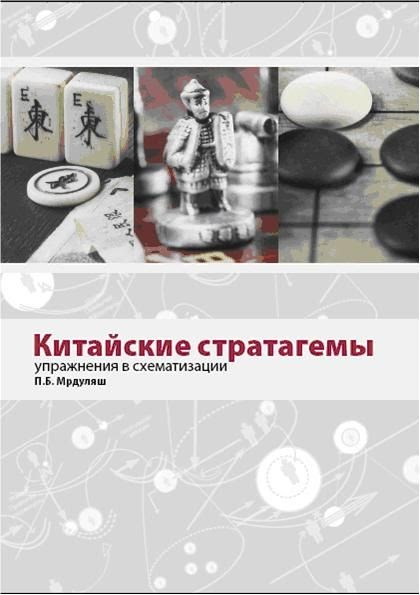
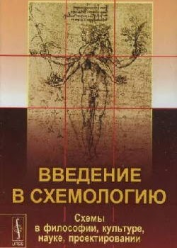
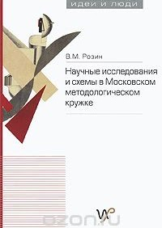
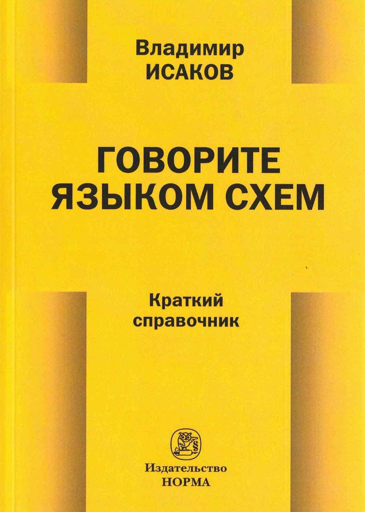
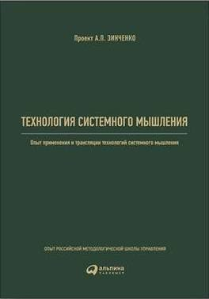
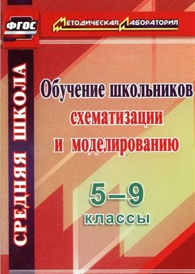
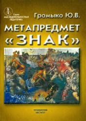
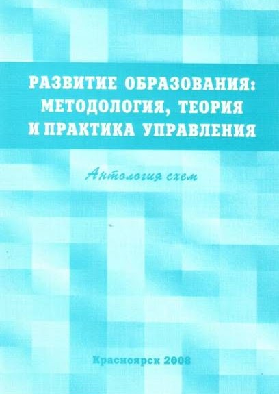

# Библиотека

        

        

        

        

        

        

        

        

        - Александр Зинченко [«Базовые схемы и представления для методологической
            работы» («Музей схем», «Альбом схем»)](http://tiny.cc/zinchenko) — набор схем, который вел А.П.Зинченко по поручению
          Г.П.Щедровицкого в 1980-х гг.

        - Александр Зинченко Схематизация как средство и форма организации интеллектуальных работ, Тольятти, 1995 г.

        - Александр Зинченко. [Игровая педагогика. Часть 3.
            Система знаний о схематизации](http://gtmarket.ru/laboratory/basis/6654/6657) Тольятти, 2000

        - Александр Зинченко. [Технология
            системного мышления](https://www.alpinabook.ru/catalog/ProjectManagment/117451/) Альпина Паблишер, 2017

        - Громыко Ю.В. [Метапредмет «Знак» Схематизация и построение
            знаков. Понимание символов](http://www.twirpx.com/file/247917/), Москва. 2001, Пушкинский дом

        - Громыко Н.В. [Обучение схематизации: Сборник сценариев для
            проведения уроков и тренингов](http://www.twirpx.com/file/646917/). Учебно-методическое пособие для учащихся 10-11 классов. — М., 2005

        - Морозов Ф.М. Схемы как средство описания деятельности (эпистемол. анализ). – М., 2005. — 181 с.

        - Мрдуляш П.Б. "[Китайские стратагемы](http://www.twirpx.com/file/654933/) (упражнения в
          схематизации)". Практическое пособие по курсу «Схематизация» - М., 2007.

        - Горностаев А.О. [Методологический
            аспект образования: тетрадь-пособие: в 4 частях](https://drive.google.com/open?id=0Bxfe9DxB15ciSUNmcmdjY3BhcTA). Красноярск, 2007. 40 с.

        - Анисимов О.С. [Схемы и схематизация: путь в культуру мышления](http://acmegroup.ru/node/135). –
          М., 2007, в 2-х т.

        - Анисимов О.С. Схемы и язык схематических изображений. – М., 2008

        - [Развитие образования: методология,
            теория и практика управления. Антология схем](https://drive.google.com/open?id=0Bxfe9DxB15cibHd0UTBUeFMxM2c). – Красноярск, 2008. - 43 с. Составитель Горностаев А.О.

        - Анисимов О.С. Мышление стратега:
            Стратегическое управление в схемах. Выпуск 7/ Сост. - В.Н. Верхоглазенко. - М., 2009

        - Розин М.В. [Научные исследования и схемы в Московском
            методологическом кружке](http://www.fondgp.ru/books/catalog/63). – М., 2011. – 495 с.

        - Розин В.М. [Введение в схемологию: Схемы в философии, культуре,
            науке, проектировании](http://www.twirpx.com/file/1178770/) М.: Либроком, 2011. — 256 с.

        - Иволгина Л.И. [Схематизация в
            обучении: методическое пособие](https://drive.google.com/open?id=0Bxfe9DxB15ciR2hLWEtRM1VpbkU) Красноярск: 2011.

        - Анисимов О.С. [«100 схем» (базисная
            парадигма языка методолога)](https://drive.google.com/open?id=0Bxfe9DxB15ciZWp5Mlh3eVFnQlU). В.Новгород. 2013

        - Иволгина Л.И. [Обучение школьников схематизации и
            моделированию](http://www.twirpx.com/file/1733018/). 5-9 классы Волгоград: Учитель, 2014. — 103 с.

        - Антонова Л.А. "История в образах", методическое пособие, Чистополь, 2009

        - Исаков В.Б. ["Говорите языком схем. Краткий
            справочник"](https://publications.hse.ru/books/176400320), Норма, Инфра-М, 2016

        - Т.М.Ковалева и др. Личностно-ресурсное картирование, как средство работы тьютора. Ресурс, 2018 — 104 с.

        - Исаков В.Б. [Правовая аналитика
            в определениях, картах, схемах: Альбом](https://drive.google.com/open?id=1EIcmanyAmaGshTwPhgjRCi9_bpPioW5C) – Москва, 2019. – 380 с.