# Издательство

        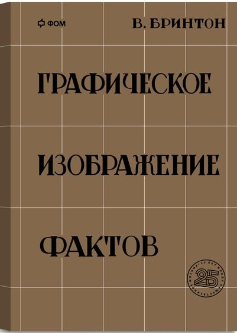

        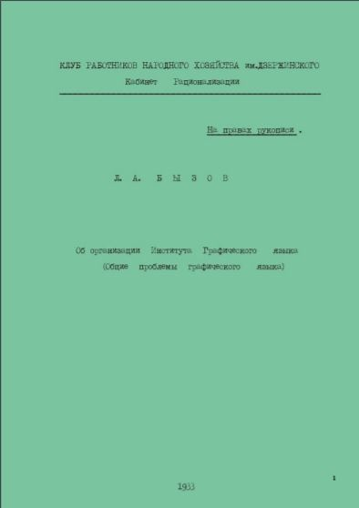

        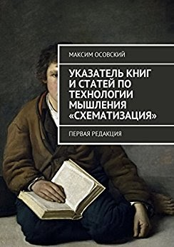

        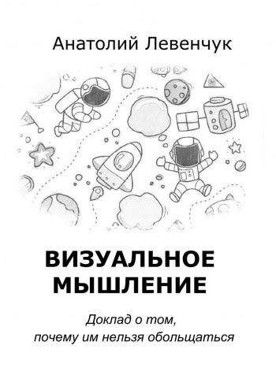

        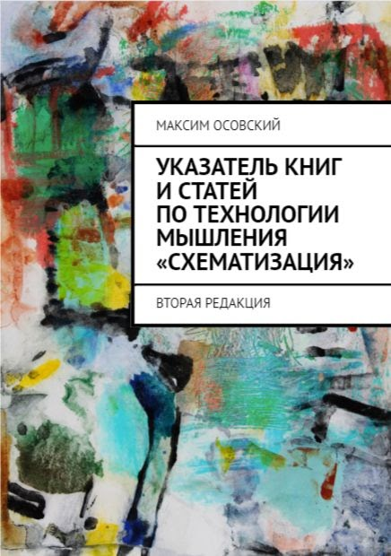

        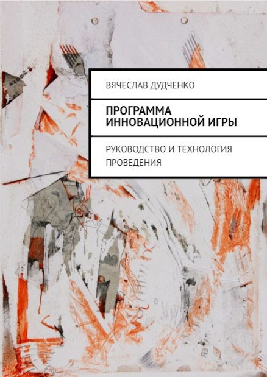

        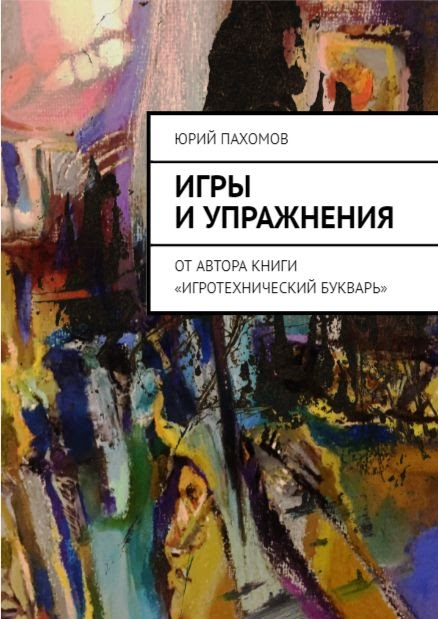

        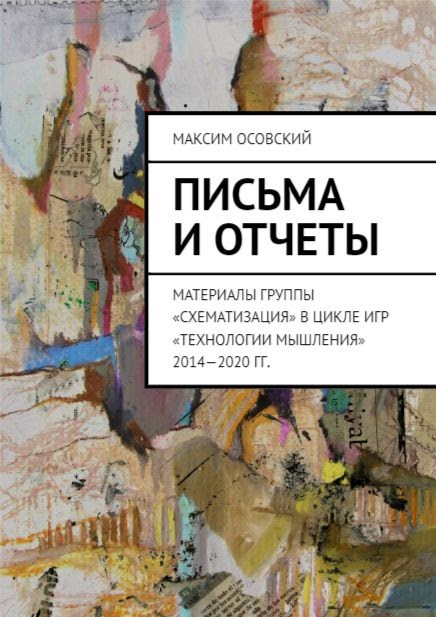

        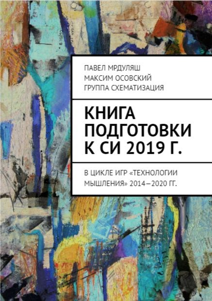

        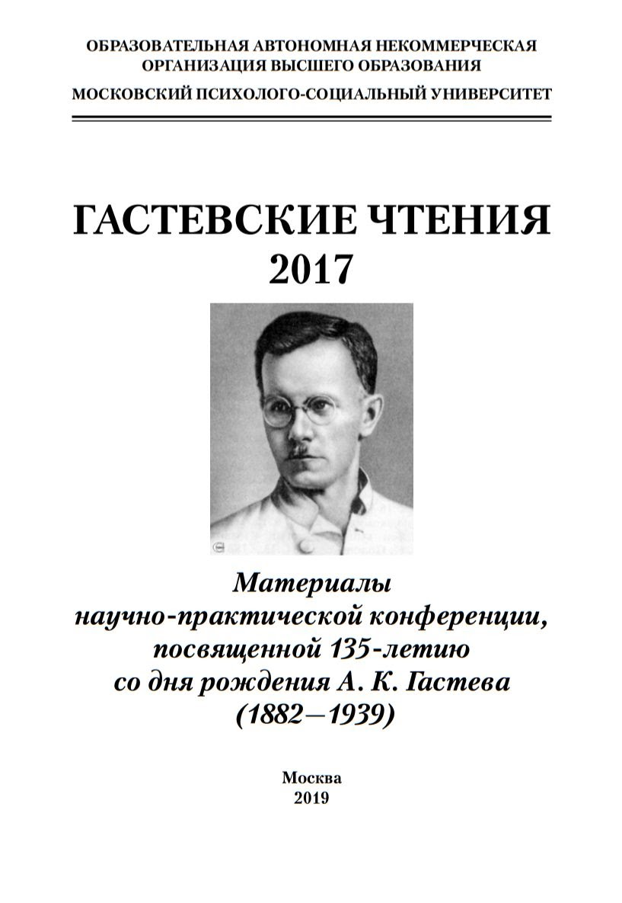

        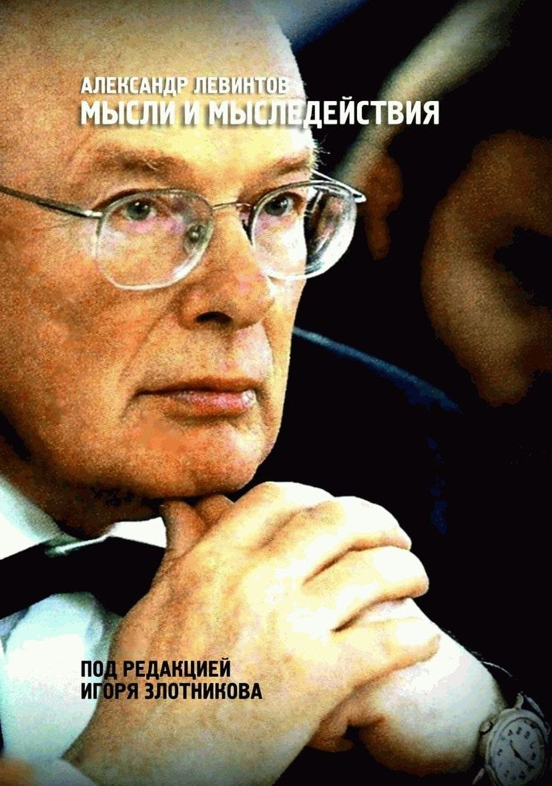

        - В.Бринтон ["Графическое изображение
            фактов"](http://fomlabs.ru/review/graficheskoe-izobrazhenie-faktov/29) (репринт), 2017 (1927), ISBN 978-5-4465-1421-2

        - Доклад [Л.А.Бызова "Об организации Института
            Графического языка"](https://app.box.com/s/8amj7rk6wotj5o9x37tbgub74ofh987g) (репринт), 2017 (1933) 39 с.

        - М.Осовский Указатель книг и статей по технологии мышления «Схематизация» : 2017, 40 с. ISBN
          978-5-4483-6448-8

        - Семин С.А. [Время
            коммуникации](http://www.fondgp.ru/lib/chteniya/27/46/prezentatciya_Semin_itogovaya.pdf), 2016, 203 с.

        - [Сборник докладов по
            схематизации (1996-2014)](https://drive.google.com/open?id=1-SGUXyTkxdSnJxr8Wkm_tIe00A7QBbx2ZdfdsUmYby0) 352 с.

        - [СХЕМАТИЗАЦИЯ Сборник
            текстов (1992-2013)](https://drive.google.com/open?id=15Ww-3OwpvGXHeYYFmLlYM3SEssQid7toEKeGVfHXk-k) 384 с.

        - [КОНФЕРЕНЦИИ И СЕМИНАРЫ Сборник
            материалов (2007-2011)](https://drive.google.com/open?id=0Bxfe9DxB15ciTWRIREZfWWNIdDA) 389 с.

        - [Сборник докладов на
            школе "Технологии мышления. Схематизация" 2015](https://drive.google.com/open?id=1ZW-QJBtpBD1-7AUHgyVXq6huKi7oOB6Q9-0uzMLQCJk) 414 с.

        - [П.Г. Щедровицкий Введение в
            синтаксис и семантику графического языка СМД-подхода](https://drive.google.com/open?id=0Bxfe9DxB15ciRGFaQ2xVR1VQMHM) 1712 с.

        - [Сборник ММК в лицах](https://drive.google.com/open?id=0Bxfe9DxB15ciQUtPWGhtNjFtc1U) 673 с.

        - [В.Дудченко "Программа инновационной
            игры"](https://ridero.ru/books/programma_innovacionnoi_igry/) 2017, 188 с.

        - [Ю.Пахомов "Игры и упражнения"](https://ridero.ru/books/igry_i_uprazhneniya/) 2018, 230 с.

        - [А.Левенчук "Визуальное мышление"](https://ridero.ru/books/vizualnoe_myshlenie/) (2018)

        - Мрдуляш, Осовский. ["Книга подготовки к СИ 2019 г."](https://goo.gl/yD8a3L) 2018, 126 с. ISBN
          978-5-4493-6764-8

        - Осовский. ["Письма и отчеты. Материалы группы за 2012-2018 гг"](https://goo.gl/ALt3dX) 2018, 220
          с. ISBN 978-5-4493-6982-6

        - [Гастевские чтения, 2017](https://drive.google.com/open?id=1h5J5svv1lcjR6XBnUupOmAR9e4_kDq2_)
          2019, 94 с.

        - [А.Е. Левинтов "Мысли и мыследействия"](https://ridero.ru/books/mysli_i_mysledeistviya/) Под ред.
          И.Злотникова, 2019, 356 с.