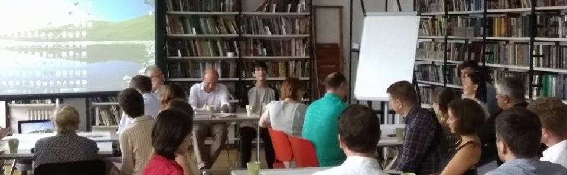
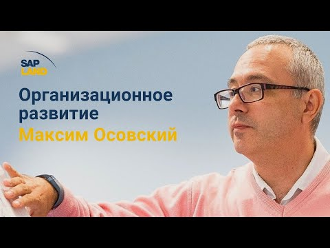
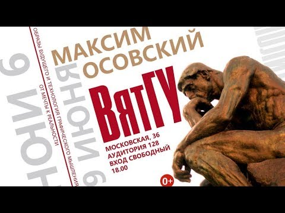

# ЛекТОРИЙ

## Семинары

- British Higher School of Art and Design - [курс "Системный подход к мышлению и деятельности"](https://drive.google.com/file/d/0B5zcQJxvqTNhOVBkb2dwWWt4a0NwMkNNRU93T0NwQVl1aENr/edit) (Осовский, 2012-2014), [фотоотчет](https://goo.gl/photos/NHp8Zmtrgqp2rVbTA)

- 

[Академия передовых практик SAP](https://youtu.be/yuZ_2aWCYt8) (Осовский, 2014)

- ДОП МГПУ - лекция об СМД-подходе (Жадько, Осовский, 2015)

- МПГУ - семинар по визуализации (Мрдуляш, 2016)

- МГПУ (ВДНХ) - "Схематизация" в рамках межвузовской олимпиады (Гайдамака, Осовский, Пинаев, 2016)

- ДПО НИУ ВШЭ - интенсив "Инфографика и презентация аналитических данных" (Горбань, 2016-2017)

- ДПО НИУ ВШЭ - "Визуальное мышление" (Горбань, Логвин, 2016-2017)

- ДПО НИУ ВШЭ - магистратура по инфографике (Горбань, 2017)

- ВШГА МГУ - занятия по схематизации (Инфимовская, Осовский, 2016-2017)

- Форсайт-школа АСИ (Мрдуляш, Осовский 2016)

- 

[Лекторий ЦСР](https://youtu.be/VF8b0kdCD2E) (Осовский, 2016)

- ВятГУ - 

["Образы будущего и технология графического мышления"](https://youtu.be/mvWV3yK_260) (Донсков, Филинков, Осовский, 2017)

- ВШГУ РАНХиГС - Школа модераторов (Мрдуляш, 2017)

- НОЧУВО МЭИ (Тольятти) - курсы (Мокроусова, 2016-2017)

- ДВФУ. Университет 20:35 (Владивосток) [Графические методы мышления](состав-группы/осовский-м-е/графические-методы-мышления/index.html) (Осовский, 2018)