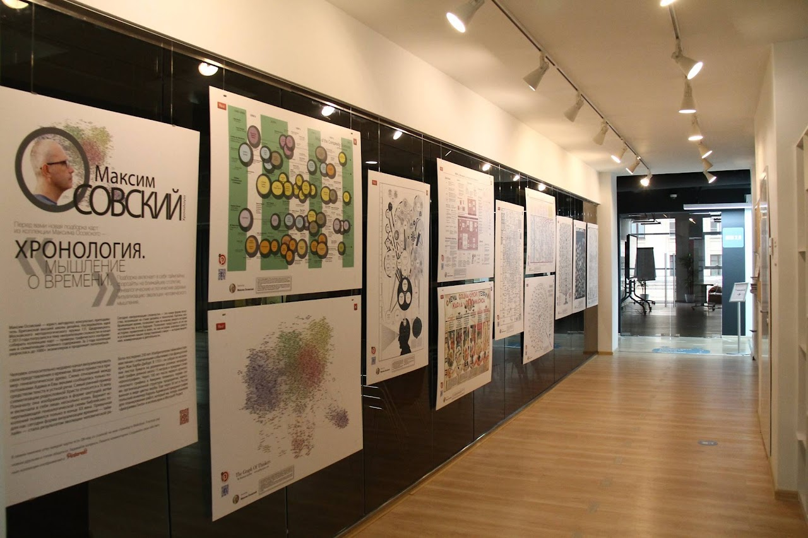
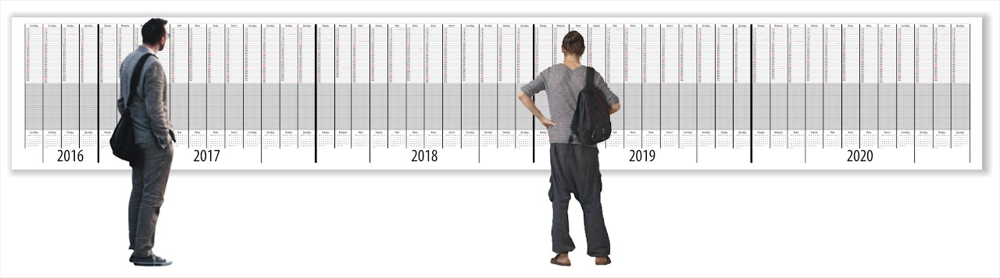
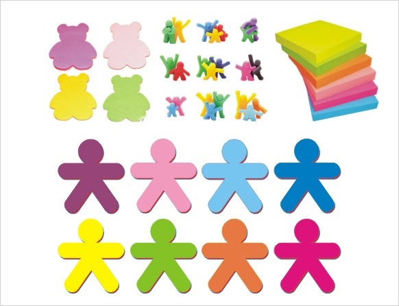
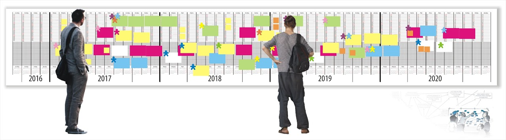

# МУЗЕЙ СХЕМ

        

        

        

        

        

      [Фотоотчёт](https://drive.google.com/open?id=0Bxfe9DxB15ciOWVfRDdPUzIwc3M) (Агентство стратегических
        инициатив, ММСО-2016)

      Календарь до 2020 года

      Стикеры позиций

      Стикеры с вариантами самоопределения/позиционирования, наклеенные на календарь до 2020 г. (прототип)