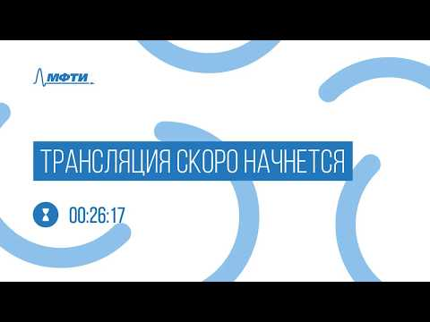

# ПЕРВАЯ ОТКРЫТАЯ ЛАБОРАТОРИЯ ВИЗУАЛЬНОГО МЫШЛЕНИЯ

      **15 СЕНТЯБРЯ 2018 г.**

      Расписание
          лаборатории

      [Сайт лаборатории](https://f-cc.org/vtlab) (webarchive)

      ### Таймкоды к видеозаписи лаборатории (площадка МФТИ)

        - Горбань А.Н. Разница естественного и искусственного в визуальном мышлении 💻 слайды 🎦 35:56

        - Воронцов К.В. Визуализация в информационном поиске 💻 слайды 🎦
          

[1:13:31](https://youtu.be/LkTDBL30gIg?t=4411)

        - Лемтюжникова Д. Картографическое представление текстового контента 💻 слайды 🎦
          

[1:28:18](https://youtu.be/LkTDBL30gIg?t=5298)

        - Финошин О.А. Визуальный анализ – выявление скрытых проблем и путей и решений в больших массивах данных 💻 слайды 🎦
          

[1:39:40](https://youtu.be/LkTDBL30gIg?t=5980)

        - Тарасенко В.В. «Слепые пятна», перипетии и узнавания визуального мышления (кейс фрактальной геометрии) 💻 слайды 🎦
          

[1:56:19](https://youtu.be/LkTDBL30gIg?t=6979)

        - Берхин И. Пространство мышления 🎦 

[3:03:40](https://youtu.be/LkTDBL30gIg?t=11020)

        - Полевая С.А. Взаимодействие визуального и вербального информационных образов при развитии лингвистических
          компетенций [💻
            слайды](https://drive.google.com/file/d/1BEMXvv4SfrpVx1X5mZlRUVNEEZmqxMeK/view?usp=sharing) 🎦 

[3:30:24](https://youtu.be/LkTDBL30gIg?t=12624)

        - Нехорошева Е. Сверхпредметность и универсальность инструментов современных психотерапевтических модальностей
          [💻 слайды](https://drive.google.com/file/d/1hf47--E1gve6uHxn-aO0FMH3J733evz_/view?usp=sharing) 🎦
          

[3:52:55](https://youtu.be/LkTDBL30gIg?t=13975)

        - Соболева Е.В., Шалагинова Н.В. Виртуальный помощник в определении интеллектуальной компетентности 💻 слайды 🎦
          

[4:15:47](https://youtu.be/LkTDBL30gIg?t=15347)

        - Рубанов В.А. Геометрические методы представления данных и построения смысловых алгоритмов 💻 слайды 🎦
          

[4:37:18](https://youtu.be/LkTDBL30gIg?t=16638)

        - Злотников И.В. Визуализация в проекте AETERNUM 💻 слайды 🎦
          

[4:55:06](https://youtu.be/LkTDBL30gIg?t=17706)

        - Зиновьев А. Нестандартные и интерактивные методы визуализации знаний и данных 💻 слайды 🎦
          

[5:59:35](https://youtu.be/LkTDBL30gIg?t=21575)

        - Мокроусова Ю. Схематизация в маркетинге, поддержка бренда 💻 слайды 🎦
          

[6:33:46](https://youtu.be/LkTDBL30gIg?t=23626)

        - Легуша Д. Как рисовать незримое. Сравнительный анализ методов визуализации абстрактных понятий 💻 слайды 🎦
          

[7:10:17](https://youtu.be/LkTDBL30gIg?t=25817)

        - Новичков А. Влияние новых инструментов графического и мультимедийного дизайна на доступность использования
          визуального мышления 💻 слайды 🎦
          

[7:42:52](https://youtu.be/LkTDBL30gIg?t=27772)

        - Лима М. Visualization Metaphors: Unraveling the Big Picture 💻 слайды 🎦
          

[8:26:54](https://youtu.be/LkTDBL30gIg?t=30414)

        - Панельная дискуссия научных партнеров Лаборатории ✍️ расшифровка 🎦 9:08:11

      ### [Секция практической визуализации](https://f-cc.org/vtlab_practice) (площадка Deloitte) фото

        - Роуди М. The Story of Sketchnotes. Последовательный перевод на русский

        - Хабибова А. Ментальные карты в обучении дизайну 💻 слайды

        - Максименкова О. Использование интеллект-карт в учебном процессе

        - Бикбулатов А. Диджитал скрайбинг, как структурировать мозг 💻 слайды