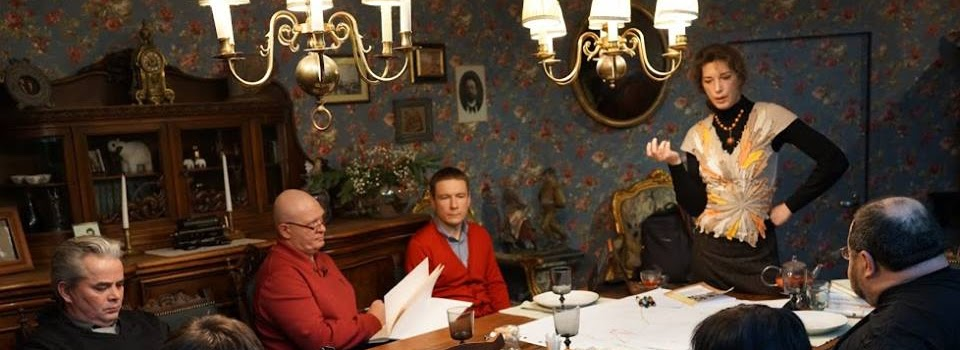
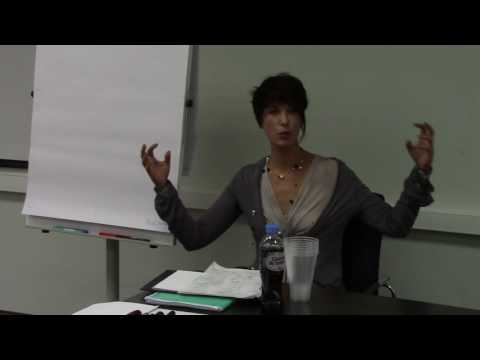
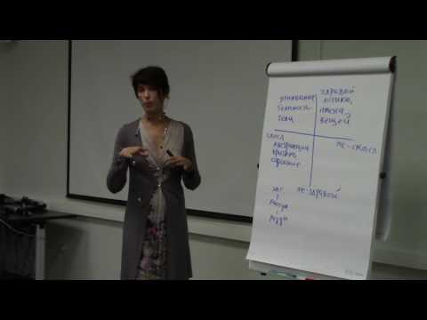
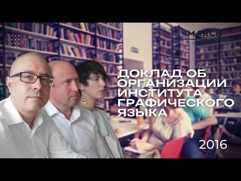
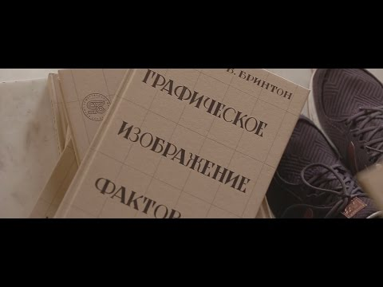
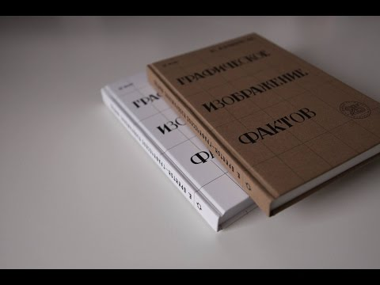
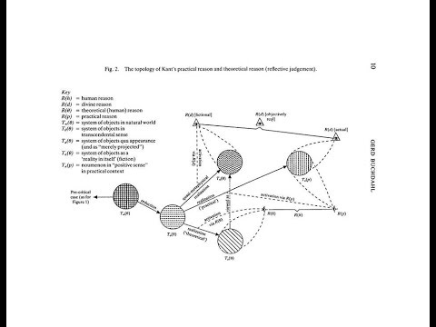
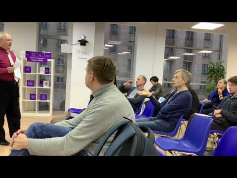

# Лаборатория Визуального мышления

- 25.06.2014 вводный [семинар](https://goo.gl/kD1VhM) А. Горбань «Типология схем» ([краткое содержание](http://telegra.ph/AB-OVO-01-23))

- 06.09.2014 [семинар](https://goo.gl/vNNrwv) А. Горбань «Визуальное мышление» ([краткое содержание](https://goo.gl/7tujpT))

- 26.09.2014 [доклад](https://goo.gl/Uh4eUQ) А. Горбань «Язык визуального мышления. Маркеры предвнимания» ([краткое содержание](https://goo.gl/9DjoSA))

- 24.10.2014 доклад А. Горбань «Технологии визуального мышления» (краткое содержание [часть1](https://goo.gl/tyZLaC) [часть2](https://goo.gl/F3mMwC) [часть3](https://goo.gl/ooCcYv))

- ?.11.2014 доклад А. Горбань «История визуального мышления» (краткое содержание [часть3](https://goo.gl/QoS3b5))

- 16.12.2014 [доклад](https://goo.gl/5TSYGe) А. Горбань «Графические методы описания данных»

- 22.02.2015 [доклад](https://goo.gl/og6fvb) А. Горбань «Инфографика» [видео](https://photos.app.goo.gl/b7vV2p9ETS9bvEhf8)

- 11.03.2015 [доклад](https://goo.gl/5b5YzU) М. Осовского «Обсуждение карты исторической реконструкции создания методов визуализации» [видео](https://photos.app.goo.gl/XdFTx6xE4gRE27UX2)

- 04.06.2015 [доклад](https://goo.gl/ZsN1eP) В. Кульматова «Схематизация диалектики: борьба рассудка с разумом»

- 13.09.2015 [доклад](https://goo.gl/JwZwKR) С. Голованова «Визуализация в „Духовных упражнениях" Игнатия Лойолы (XVI в.)»

- 01.10.2015 Дуэль визуализаторов на выставке «HR Expo»

- 10.10.2015 [доклад](https://goo.gl/aKyUGb) Б. Родомана

- 04.04.2016 [семинар](https://goo.gl/UvsxSa) А. Горбань «Использование визуализации в бизнес-процессах»

- 14.09.2016 интеллект-хакатон А. Горбань «К понятию феномена эстетического интеллекта» 

[часть 1](https://youtu.be/E7CzRX9rm-0); 

[часть 2](https://youtu.be/SD0EU1KyhT4)

- 19.04.2016 «Слово и образ в научных исследованиях» Докладчик — Елена Борисовна Козеренко

- 16-17. (семинары П.Б.Мрдуляша МПГУ)

- 4.08.2016 

[презентация доклада](https://youtu.be/yDVWFB4bFTI) «Об организации Института Графического языка» (1933 г.) Л.А.Бызова

- 26.10.2016 [доклад](https://goo.gl/z7RtZz) А. Горбань «Визуализация как инструмент работы с неопределенностью»

- 11.03.2017 [доклад](http://telegra.ph/Intellektual-i-ego-sreda-obitaniya-06-26) А. Горбань «Интеллектуал и его среда обитания»

- 15.03.2017 

[презентация книги](https://youtu.be/ceBRUjqwDUI) В. Бринтона «Графическое изображение фактов» в РАНХиГС

- 15.05.2017 

[презентация книги](https://youtu.be/URI-zp9rEdg) В. Бринтона в Библиотеке им. Ф.М.Достоевского

- 15.06.2017 [доклад CIO «Еврохим» В.Н.Чибисова](https://goo.gl/LGP85J) «Большие данные и визуальное мышление в корпорации»

- 19.07.2017 доклад Осовского «Организационные планы» [расшифровка](https://goo.gl/B8Nb8X)

- 26.08.2017 завтрак [на тему осознанного движения](https://ailev.livejournal.com/1370125.html) (Левенчук, Осовский, Сироткина, Шевченко)

- 25.10.2017 сессия «Схематизация и использование графических методов в стратегическом планировании» — [Форум стратегов](http://forumstrategov.ru/rus/306.html)

- 11.11.2017 [«Первые Гастевские чтения»](https://www.facebook.com/groups/Gastev/)

- 12.02.2018 Круглый стол: [«Образ будущего как основа экономической стратегии»](https://leader-id.ru/event/5412/)

- 3-4.03.2018 [Семинар «Открытые данные в образовании»](https://www.facebook.com/osovskiy/posts/10213242447233884) [видео](https://photos.app.goo.gl/gQmVpwnyEc6f38zS2)

- 29.03.2018 [Семинар «Открытые данные в образовании»](https://goo.gl/miaP1C) в Аналитическом центре Правительства РФ

- 24.05.2018 Доклад А. Левенчука. [Leader-ID](https://leader-id.ru/event/8628/), [видео](https://photos.app.goo.gl/gIerftuGbA2nNqes1), [vimeo](https://vimeo.com/272129795), [расшифровка](https://goo.gl/4LLac4), книга [«Визуальное мышление»](https://ridero.ru/books/vizualnoe_myshlenie/)

- 16.06.2018 Доклад С. Л. Катречко. 

[видео](https://youtu.be/hBMutQmDtas), [расшифровка](https://goo.gl/iAdVvy)

- 5.07.2018 Доклад Д. Бахтурина «Работа П.М.Якобсона»

- 29.08.2018 Доклад В.Н.Чибисова «Цифровая трансформация» [видео](https://photos.app.goo.gl/sY2jpAdqw3ZSqRzA9)

- 15.09.2018 [Первая открытая лаборатория по визуальному мышлению](семинары/1-конференция/index.html)

- 12.10.2018 Семинар по визуализации данных [фото](https://goo.gl/2xoSmw), [аудио](https://goo.gl/fyUJUR)

- 25.10.2018 сессия «Визуализация данных в стратегическом планировании» — [XVII Форум стратегов](https://forumstrategov.ru/rus/program/stol27.html)

- 12.04.2019 Доклад В. Б. Исакова. [Анонс](https://leader-id.ru/event/17280/), 

[видео](https://youtu.be/guvUln_zSTc)