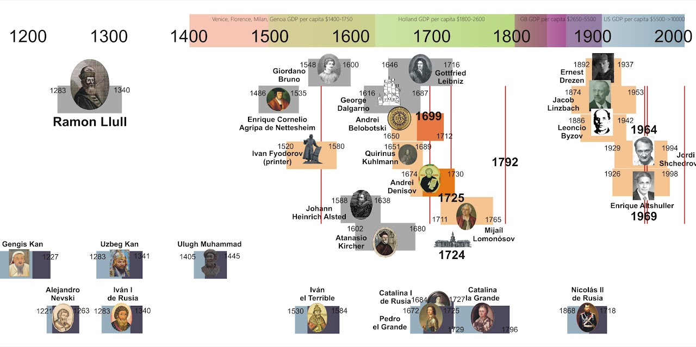
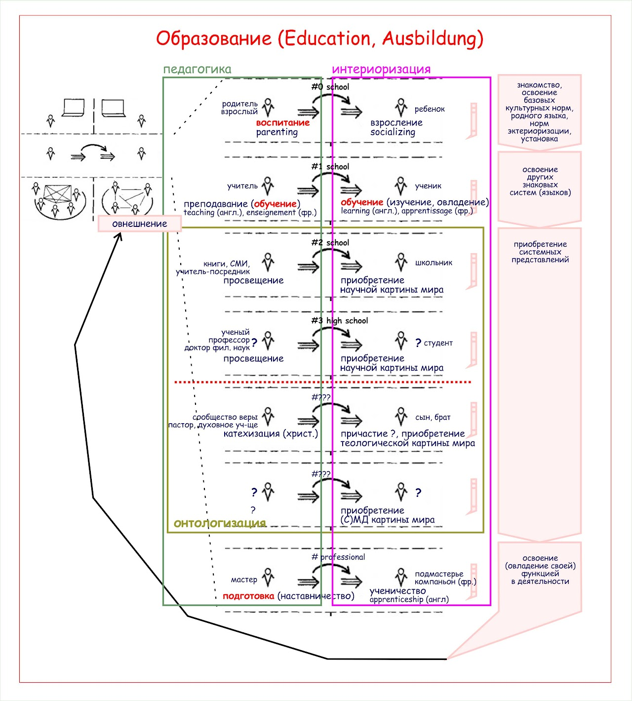

# Осовский М.Е.

[видео📺 YouTube (Лекции, игры, интервью)](youtube/index.html)

V. Kulmatov, M. Osowski ["The Spread of Raymond Llull's Ideas in Russian"](https://docs.google.com/document/d/13vUetl14YwoMgAbUb5pJOy47V8LorKnRLXTQXYo0fw4/edit?usp=sharing) (Uneversitat de Barcelona, Nov 2016)

Осовский М.Е. ["Школа - пространство для посторонних"](https://osovsky.medium.com/%D1%88%D0%BA%D0%BE%D0%BB%D0%B0-%D0%BF%D1%80%D0%BE%D1%81%D1%82%D1%80%D0%B0%D0%BD%D1%81%D1%82%D0%B2%D0%BE-%D0%B4%D0%BB%D1%8F-%D0%BF%D0%BE%D1%81%D1%82%D0%BE%D1%80%D0%BE%D0%BD%D0%BD%D0%B8%D1%85-f57318e31562), 2013

Осовский М.Е. [Зарисовки об истории мышления](https://docs.google.com/document/d/1KY6Wco6vx-plptd_u8Mm7pnMAtmoqLH7FqzE36ltbzs/edit?usp=sharing), 16 марта 2013 г.

Осовский М.Е. ["Задачи педагогики"](https://osovsky.medium.com/%D0%B7%D0%B0%D0%B4%D0%B0%D1%87%D0%B8-%D0%BF%D0%B5%D0%B4%D0%B0%D0%B3%D0%BE%D0%B3%D0%B8%D0%BA%D0%B8-c0a12ebf3a7b), 2012-2013

Осовский М.Е. [Доклад на семинаре "Институты и институционализация"](https://drive.google.com/open?id=0Bxfe9DxB15cidWVZeTIxTTdpQTJHTV9yT0NpYldpUDMydEpJ) 1 марта 2012 г.

Осовский М.Е. Выступление на Семейной игре "Онтология мыследеятельности" 21.01.2012 [видео](https://vimeo.com/37936939)

Осовский М.Е. Выступление на Семейной игре "Онтология. Социальный мир" 17.01.2011 [видео](https://vimeo.com/33616843)