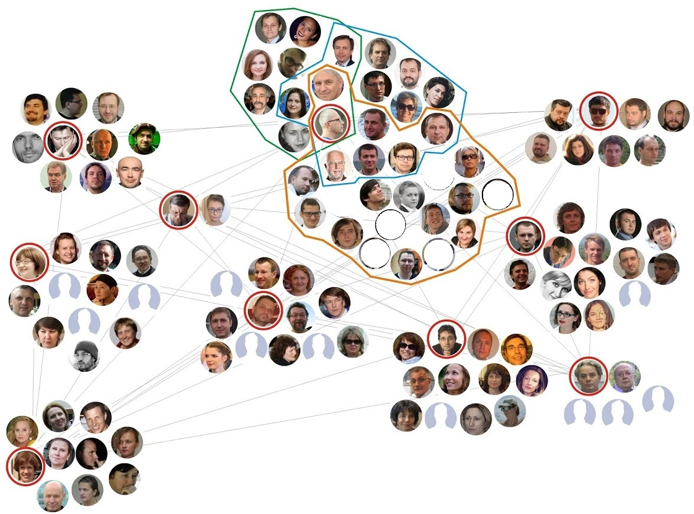
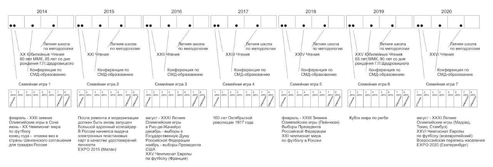

# Цикл игр "Технологии мышления"

      В течение 20 лет Школа культурной политики проводит организационно-деятельностные игры, направленные на
        обсуждение перспективы собственного развития. Было проведено три семилетних цикла игр: по «Проектированию и
        программированию», по «Проектированию нового поколения гуманитарных технологий» и серия «Технологии мышления».

      ## Календарь цикла игр "Технологии мышления" 2014-2020

        

        

        

        

      [Открыть в максимальном
          качестве](https://drive.google.com/file/d/0B5zcQJxvqTNha2ZWU1ZLUGRzaU0/view?usp=sharing)

      График из доклада, сделанного на 2-й конференции по подготовке цикла игр "Технологии мышления" (Осовский, 30
        мая 2013 г., Библиотека им. К.Д.Ушинского)